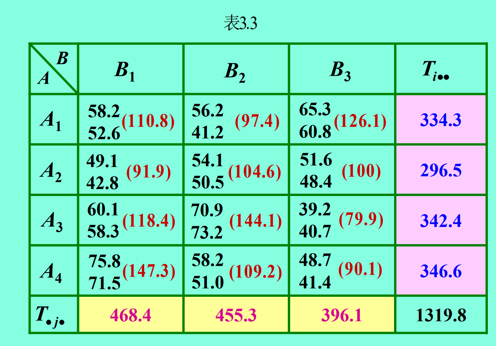

数理统计复习总结

#### 1 一元方差分析

**方差分析表**

| 来源         | 离差平方和 | 自由度 | 均方离差          | F比                                         |
| ------------ | ---------- | ------ | ----------------- | ------------------------------------------- |
| 组间（因素） | $S_A$      | s-1    | $\overline {S_A}$ | F = $\overline{S_A}$  /$ {\overline {S_E}}$ |
| 组内（误差） | $S_E$      | n-s    | $\overline {S_E}$ |                                             |
| 总和         | $S_T$      | n-1    |                   |                                             |

$$
S_A={{\sum\limits_{j=0}^s}\frac {T_{·j}^2} {n_j}} - \frac{T_{··}} {n}
$$

$$
S_T={{\sum\limits_{i=1}^{n_j}\sum\limits_{j=1}^s}x_{ij}^2} - \frac{T_{··}} {n}
$$

**$S_E=S_T-S_A$**

  $\overline {S_A}$​=$S_A$​ / $(s-1)$​                $\overline {S_E}$ = $S_E$ / $(n-s)$

而 $T_{·j} = \sum\limits_{i=1}^{n_j}x_{ij}$                      $T_{··}$ = ${\sum\limits_{i=1}^{n_j}\sum\limits_{j=1}^s x_{ij}}$

最后对比 **F**与 $F_{\alpha}(s-1,n-s)$ , 若 **F** > $F_{\alpha}(s-1,n-s)$ 则有显著性影响。

##### 例1 

#### 2 二元方差分析(有交互)

**方差分析表**

| 来源        | 离差平方和       | 自由度         | 均方                         | F比值                                                        |
| ----------- | ---------------- | -------------- | ---------------------------- | ------------------------------------------------------------ |
| 因素A       | $S_A$            | r - 1          | $\overline {S_A}$            | $F_A$ = $\overline {S_A}$ / $\overline S_E$                  |
| 因素B       | $S_B$            | s - 1          | $\overline {S_B}$            | $F_B$ = $\overline {S_B}$ / $\overline {S_E}$                |
| 交互作用A×B | $S_{A \times B}$ | (r - 1)(s - 1) | $\overline {S_{A \times B}}$ | $F_{A \times B}$ = $\overline {S_{A \times B}}$ / $\overline {S_E}$ |
| 误差        | $S_E$            | rs(t - 1)      | $\overline {S_E}$            |                                                              |
| 总和        | $S_T$            | rst - 1        |                              |                                                              |

**记**

$T_{···} = \sum\limits_{i=1}^r\sum\limits_{j=1}^s\sum\limits_{k=1}^t x_{ijk}$                $T_{ij·} = \sum\limits_{k=1}^t x_{ijk}$                    $T_{i··} = \sum\limits_{j=1}^s\sum\limits_{k=1}^t x_{ijk}$                     $T_{·j·} = \sum\limits_{i=1}^r\sum\limits_{k=1}^t x_{ijk}$

则

$S_A = \frac {1}{st} \sum\limits_{i=1}^r{(T_{i··})^2} - \frac {(T_{···})^2}{rst}$                             $\overline {S_A} = S_A / (r-1)$

$S_B = \frac {1}{rt} \sum\limits_{j=1}^s{(T_{·j·})^2} - \frac {(T_{···})^2}{rst}$                             $\overline {S_B} = S_B / (s-1)$

$S_{A \times B} = \frac {1}{t} \sum\limits_{i=1}^r\sum\limits_{j=1}^s{(T_{ij·})^2} - \frac {(T_{···})^2}{rst} - S_A - S_B$                       $\overline {S_{A\times B}} / (r-1)(s-1)$

$S_T = \sum\limits_{i=1}^r\sum\limits_{j=1}^s\sum\limits_{k=1}^t (x_{ijk})^2 - \frac {(T_{···})^2}{rst} $

$S_E = S_T - S_A - S_B - S_{A\times B}$                     $\overline {S_E} = S_E / rs(t-1)$

再查表比较F，看各因素和其交互作用的影响是否显著

##### 例2

#### 3 回归分析

最多三问

##### 求回归方程

$S_{xx} = \sum\limits_{i=1}^n (x_i)^2 - n \bar x^2$

$S_{yy} = \sum\limits_{i=1}^n (y_i)^2 - n \bar y^2$

$S_{xy} = \sum\limits_{i=1}^n x_i y_i - n \bar x \bar y $

**$\hat b$** = $S_{xy}$ /  $S_{xx}$                            **$\hat a$** = $\bar y - b\bar x$

**PS**:  这里          $\sum\limits_{i=1}^n (x_i)^2$                     $\sum\limits_{i=1}^n (y_i)^2$              $\bar x$                   $\bar y$   均可在计算器中取得（回归模式），甚至 b和a也可以由计算器得到

##### 求预测区间

$(\hat \sigma ^*)^2 = \frac {Q_e}{n-2}$    其中 $Q_e = S_{yy} - \hat b S_{xy}$

$\delta(x_o) = t_{\frac {\alpha}{2}}(n-2) \sqrt{(\hat \sigma ^*)^2 [1 + \frac {1}{n} + \frac{(x_o-\bar x)^2}{S_{xx}}]} $

$Y_o$的置信水平为$1-\alpha$的预测区间为

$[\hat {y_o} - \delta(x_o) , \hat {y_o} + \delta(x_o)]$

##### 例3

#### 4 随机过程

##### 4.1 求分布函数 

① **t**取$t_0$时，得到X($t_0$)，是一个关于随机变量的函数

② 画概率分布表，得到随机变量取不同值时，对应X($t_0$)取到的值和概率

③由概率分布表得到分布函数

+ ==一维分布函数==

  这个简单，不做讲解描述

+ ==二维分布函数==

  + 代点分析法

    在坐标系内找到可能取到的点，以点为中心画十字线（垂直于x轴和y轴的直线），各个点的十字线相交将坐标系划分为各个小区域

    在每个小区域内（内部，不在边界取）分别任取一点（$x_1,x_2$）,逐个验证{X($t_1$)$\le x_1$,$X(t_2) \le x_2$}是否成立，若成立，则$P(X(t_1),X(t_2))$这个概率满足该区域，

  + 看图直观法

    同样划分小区域

    之后看每个小区域的左下角是否存在$(X(t_1),X(t_2))$,若存在，则该点发生的概率满足这个小区域

​                                                                                                                                                                                                                                                                                                                                                                                                                                                                                                                                                                                                                                                                                                                                                                                                                                                                                                                                                                                                                                                                                                                                                                                                                                                                                                                                                                                                                                                                                                                                                                                                                                                                                                                                                                                                                                                                                                                                                                                                                                                                                                                                                                                                                                                                                                                                                                                                                                                                                                                                                                                                                                                                                                                                                                                                                                                                                                                                                                                                                                                                                                                                                                                                                                                                                                                                                                                                                                                                                                                                                                                                                                                                                                                                                                                                                                                                                                                                                                                                                                                                                                                                                                                                              

##### 4.2  均值函数$m_x(t)$ 相关函数$R_X(t_1,t_2)$ 

套公式计算，没什么说的,多练练就行，只会碰到两种情况，①随机变量A是离散的 ②随机变量A服从均匀分布

+ $m_x(t) = E[X(t)] $       
  + X(t)中含有随机变量A，所以计算期望就只用看随机变量A是离散的还是连续的（连续分布只见过均匀分布），计算对应期望就好，最后得到关于**t**的函数

+ $R_x(t_1,t_2) = E[X(t_1)X(t_2)] = R_x(\tau)$           $\tau = t_2 -t_1$

##### 4.3 平稳性 和 **各态历经性**

+ 判断平稳性
  $$
  \begin{cases}
  m_x(t) = E[X(t)] = 常数 \\
  R_x(t,t+\tau) = E[X(t)X(t+\tau)] = R_x(\tau)          \qquad     即是\tau的一元函数
  \end{cases}
  $$
  
  
  

同时满足上述两个条件，则具有平稳性

+ 判断各态历经性

  + ①判断均值函数

    $<X(t)> = \lim_\limits{T \to +\infty} \frac {1}{2T}\int_{-T}^T X(t)dt = E[X(t)] = m_x(t)$

    若上式成立，则均值函数有各态历经性

  + $<X(t)X(t+\tau)> = \lim_\limits{T \to +\infty} \frac {1}{2T}\int_{-T}^T X(t)X(t+\tau)dt = E[X(t)X(t+\tau)] = R_x(t,t+\tau)$

​				若上式成立，则相关函数具有各态历经性

#### 5 求输出Y的谱密度和相关函数 

这一题无非就两种题型，不一定要懂傅里叶，但公式一定要记住，剩下的就只是计算功夫

整体计算流程

题目给$R_x(\tau)$

计算X的谱密度$S_X(\omega) = \int_{-\infty}^{+\infty}R_x(\tau)e^{-i\omega\tau}d\tau$ 

频率响应函数固定为 $H(\omega) = \frac{\alpha}{i\omega+\alpha} $            且$|H(\omega)|^2 = \frac {\alpha^2}{\omega^2+\alpha^2}$

由此得出 $S_Y(\omega) = |H(\omega)|^2S_X(\omega)$

而Y的谱密度通过逆傅里叶变换 $F^{-1}[S_Y(\omega)] = \frac{1}{2\pi}\int_{-\infty}^{+\infty}S_Y(\omega)e^{i\omega\tau}d\omega$

另外需要记住的几个公式：$\frac{1}{2\pi}\int_{-\infty}^{+\infty}1 · e^{-i\omega\tau}d\tau = \delta(\omega) \Leftrightarrow \int_{-\infty}^{+\infty}1 · e^{-i\omega\tau}d\tau = 2\pi\delta(\omega)$

​												$F^{-1}[2\pi\delta(\omega)] = \frac{1}{2\pi}\int_{-\infty}^{+\infty}2\pi\delta(\omega)e^{i\omega\tau}d\omega = \int_{-\infty}^{+\infty}\delta(\omega)e^{i\omega\tau}d\omega = 1$

##### 类型一

+ ##### 第一种类型：X的相关函数$R_x(\tau)$是关于$cos$函数

​       **16年 18年 21年  这三年是第一种题型**

​		这里把历年解题过程放上，过程尽可能写的详细，主要就是计算问题，多练

   	需要会用欧拉公式：$cos\theta = \frac{e^{i\theta}+e^{-i\theta}}{2}$

**18、21年**

##### **类型二**

17年 19年是第二种类型

该类型给出X的谱密度，谱密度不是$cos$函数，而是分数形式$\frac {b}{\omega^2+a}$

老师讲课PPT中有道题证出：$F^{-1}(\frac{2\alpha}{\alpha^2+\omega^2} = e^{-\alpha|\tau|})$ ,可直接当作结论用

计算过程就是往这个结论的形式凑，凑出来答案就有了

**17年题**

**19年**

#### 6 马尔可夫

以上是求绝对概率和多维概率的例子，看完足够应付考试。这道题的特别之处就在于状态空间为{0，1，2}，**即状态空间从0开始**，这种是近年考试中22年第一次这么考，翻阅往年试卷状态空间都是从1开始，注意就好。

证明具有便利性和求极限分布看往年试题给的答案就OK，
